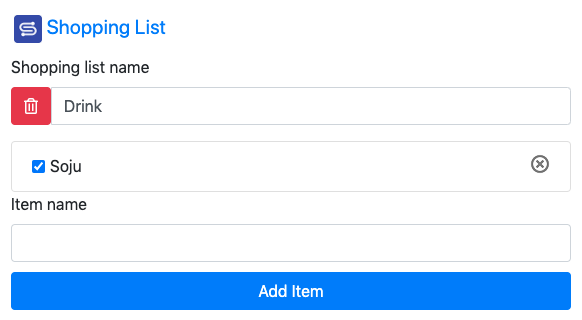
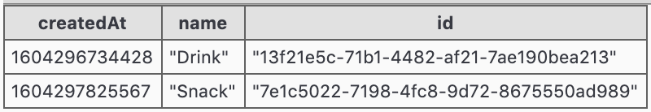

# Shopping List With Redux Hooks

## Run

```bash
yarn
yarn dev
```

---

## 개념

### 이벤트 소싱 패턴


- Microsoft: [Event Sourcing Pattern](https://docs.microsoft.com/ko-kr/azure/architecture/patterns/event-sourcing)

보통 데이터베이스를 구성할 때는 데이터의 현재 상태만을 저장한다.  
이벤트 소싱은 데이터를 이용한 **기록**을 **추가 전용 저장소** (append-only store)에 저장한다.  
추가 전용 저장소는 기록 보관소 역할을 한다.  
이 기록으로 도메인 개체를 구체화할 수가 있다.

#### 장점

1. 복잡했던 도메인 작업이 간단해진다.
   - 이유: 동기화 불필요. 데이터 모델 != 비즈니스 도메인
   - 결과: 확장성, 응답성 ↑
1. 일관적인 트랜잭션 데이터: 데이터 변화 과정에 모순이 없다.
1. 전체 감사 추적(full audit trails)과 기록이 남는다.
   - 데이터를 다시 보정할 수 있다.

#### 기존 CRUD 데이터 처리 특징

1. 현재 상태 변경 요구
1. 데이터 잠금 필요
1. 트랜잭션 사용
1. 새 값으로 수정

##### 기존 CRUD 제한 사항

- 성능, 응답 속도 저하, 확장성 제한: 데이터 저장소에서 직접 업데이트 작업을 수행해야 하기 때문.
- 업데이트 충돌: 많은 동시 사용자 → 단일 데이터 항목 공동 작업 → 충돌
- 기록 유실: 로그를 기록하는 추가적인 감사 메커니즘(auditing mechanism)이 없을 때

#### 이 패턴이 좋지 않은 경우

- 작거나 단순한 도메인
- 비즈니스 로직이 거의 없거나 전혀 없는 시스템
- 기존 CRUD 데이터 관리 메커니즘으로 잘 동작하는 비도메인 시스템
- 데이터 뷰에 대한 일관성, 실시간 업데이트가 필요한 시스템
- 감사 추적, 기록, 작업 롤백, 재생 기능이 필요 없는 시스템
- 기본 데이터에 대한 업데이트 충돌 발생이 매우 적은 시스템
   - 예를 들어, 데이터를 업데이트하지 않고 주로 추가하는 시스템


### CQRS 패턴


**명령 및 쿼리 책임 분리** 패턴  
이벤트 소싱은 일반적으로 CQRS 패턴과 결합된다.

- 데이터 저장소에 대한 읽기 및 업데이트 작업을 분리한다.
- 성능, 확장성 및 보안 ↑
- 도메인 수준에서 병합 충돌 방지

기존 데이터베이스는 동일한 데이터 모델을 이용하여 쿼리와 업데이트를 한다.  
간단한 CRUD 작업에 적합하다.  
하지만 복잡한 애플리케이션에서는 복잡한 모델이 필요하게 된다.  

읽기와 쓰기 작업은 성능과 확장의 요구사항이 비대칭인 경우가 많다.

#### 장점

- 읽기와 쓰기를 독립적으로 확장할 수 있다.
- 읽기 스키마와 쓰기 스키마를 독립적으로 관리할 수 있다.
- 쓰기 작업을 할 때 쉽게 데이터를 검증할 수 있다.
- 읽기 모델이 간단해진다.
- 쿼리가 간단해진다.

---

## Screenshots

### Shopping List


### Item List



### Event Store


### Read Models



---

- [reimagined/resolve](https://github.com/reimagined/resolve)
- [reSolve](https://reimagined.github.io/resolve/): Full stack CQRS, DDD, Event Sourcing framework for Node.js
